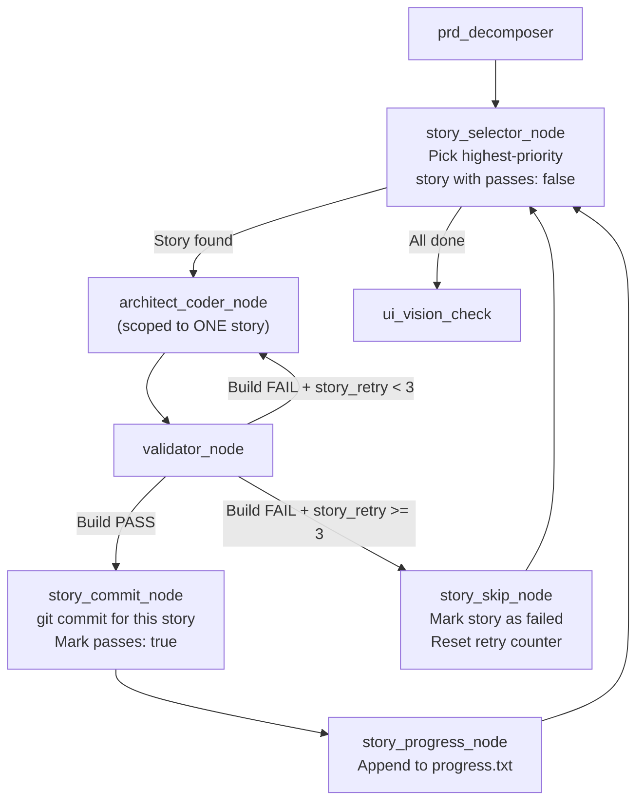

# Ralph Integration: Implementation Plan

## Overview

Integrate Ralph's autonomous loop patterns (multi-story decomposition, cross-iteration learning, incremental commits) into Lios-Agent's LangGraph pipeline. The plan is structured as three independent phases — each is independently shippable and incrementally de-risks the next.

---

## Phase 1: Progress Log + Self-Improving AGENTS.md

**Effort:** < 1 day · **Risk:** Very Low · **Graph topology:** Unchanged

### Goal

Add two Ralph-inspired mechanics to the existing pipeline without altering the graph structure:
1. **Read** a `.lios-agent/progress.txt` from the target repo during context aggregation
2. **Write** learnings back to `.lios-agent/progress.txt` and update `AGENTS.md` after a successful push

### Proposed Changes

---

#### [MODIFY] [state.py](file:///Volumes/berkakyo/Users/berkamain/Developer/w0rk/lionparcel/Lios-Agent/agent/state.py)

Add one new field to `AgentState`:

```diff
     bundle_id: str              # The app's CFBundleIdentifier for Maestro interactions
     halted: bool                # Indicates if the workflow paused due to a fatal error/rollback
+    progress_log: str           # Accumulated learnings from previous runs (read from .lios-agent/progress.txt)
```

> [!NOTE]
> This field is a simple string, not append-only. It's loaded once during context aggregation and written back at the end.

---

#### [MODIFY] [tools.py](file:///Volumes/berkakyo/Users/berkamain/Developer/w0rk/lionparcel/Lios-Agent/agent/tools.py)

Add two new functions at the end of the file (after `validate_ui_with_vision`):

##### `read_progress_log(workspace_path: str) -> str`

```python
def read_progress_log(workspace_path: str) -> str:
    """Read the Ralph-style progress log from the target repo."""
    progress_path = os.path.join(workspace_path, ".lios-agent", "progress.txt")
    if os.path.exists(progress_path):
        with open(progress_path, "r") as f:
            return f.read()
    return ""
```

##### `write_progress_log(workspace_path: str, task_id: str, instructions: str, blueprint: dict, history: list)`

```python
def write_progress_log(workspace_path: str, task_id: str, instructions: str, 
                        blueprint: dict, history: list):
    """
    Append learnings to .lios-agent/progress.txt after a successful run.
    Also updates AGENTS.md with discovered patterns via LLM.
    """
    import datetime
    
    progress_dir = os.path.join(workspace_path, ".lios-agent")
    os.makedirs(progress_dir, exist_ok=True)
    progress_path = os.path.join(progress_dir, "progress.txt")
    
    # --- 1. Append progress entry ---
    entry = f"""
## {datetime.datetime.now().isoformat()} - Task #{task_id}
- **Issue:** {instructions[:200]}
- **Feature:** {blueprint.get('feature_name', 'Unknown')}
- **Files Modified:** {', '.join(f.get('filepath', '') for f in blueprint.get('files_to_modify', []))}
- **Files Created:** {', '.join(f.get('filepath', '') for f in blueprint.get('files_to_create', []))}
- **Pipeline Result:** {history[-1] if history else 'Unknown'}
---
"""
    with open(progress_path, "a") as f:
        f.write(entry)
    
    # --- 2. LLM-powered AGENTS.md self-improvement ---
    try:
        from agent.llm_factory import get_llm
        from langchain_core.messages import HumanMessage
        
        agents_md_path = os.path.join(workspace_path, "AGENTS.md")
        existing_agents = ""
        if os.path.exists(agents_md_path):
            with open(agents_md_path, "r") as f:
                existing_agents = f.read()
        
        # Read the full progress log for context
        full_progress = ""
        if os.path.exists(progress_path):
            with open(progress_path, "r") as f:
                full_progress = f.read()[-5000:]  # Last 5k chars
        
        llm = get_llm(role="planning")
        prompt = f"""You are a senior iOS architect reviewing the results of an automated coding run.

The run just completed for Task #{task_id}: {instructions[:300]}

Pipeline history:
{chr(10).join(history[-10:])}

Existing AGENTS.md:
{existing_agents[:3000]}

Recent progress log:
{full_progress[-2000:]}

If you discovered any REUSABLE patterns, gotchas, or conventions that future runs on this codebase should know, output ONLY the new lines to APPEND to the AGENTS.md "## Codebase Patterns" section. 

Rules:
- Only add genuinely reusable knowledge (e.g., "When modifying X, also update Y")
- Do NOT repeat anything already in AGENTS.md
- Do NOT add task-specific details
- If there is nothing new to add, respond with exactly: NO_UPDATE

Output the raw markdown lines only. No explanation."""
        
        response = llm.invoke([HumanMessage(content=prompt)]).content.strip()
        
        if response and response != "NO_UPDATE" and len(response) > 10:
            with open(agents_md_path, "a") as f:
                if "## Codebase Patterns" not in existing_agents:
                    f.write("\n\n## Codebase Patterns\n")
                f.write(f"\n{response}\n")
            print(f"📝 Self-improved AGENTS.md with {len(response)} chars of new patterns.")
        else:
            print("📝 No new AGENTS.md patterns discovered this run.")
    except Exception as e:
        print(f"⚠️ AGENTS.md self-improvement failed (non-fatal): {e}")
```

---

#### [MODIFY] [graph.py](file:///Volumes/berkakyo/Users/berkamain/Developer/w0rk/lionparcel/Lios-Agent/agent/graph.py)

Two surgical patches:

##### Patch 1: Context Aggregator (line ~155)

After the agent skills compilation block and before the final `return`, inject progress log reading:

```python
    # --- Ralph Integration: Read cross-task progress log ---
    progress_log = ""
    if workspace_path:
        from agent.tools import read_progress_log
        progress_log = read_progress_log(workspace_path)
        if progress_log:
            context_parts.append(f"## Prior Run Learnings (progress.txt)\n{progress_log[-3000:]}")
            print(f"📖 Loaded {len(progress_log)} chars of cross-task learnings from progress.txt")
```

Update the return dict to include:

```diff
     return {
         "mcp_context": context_data,
         "agent_skills": agent_skills,
+        "progress_log": progress_log,
         "history": ["Context Aggregator Node executed. Serena onboarding + external tools queried."]
     }
```

##### Patch 2: Push Node (line ~860, inside `push_node`)

After the successful push block (where `halted` is set to `False`), add the progress log write:

```python
        # --- Ralph Integration: Write learnings to progress.txt + AGENTS.md ---
        if "ERROR" not in push_msg and "SKIPPED" not in push_msg:
            from agent.tools import write_progress_log
            try:
                write_progress_log(
                    workspace_path, 
                    task_id, 
                    state.get("instructions", ""),
                    state.get("blueprint", {}),
                    state.get("history", [])
                )
                print("📝 Progress log and AGENTS.md updated with learnings.")
            except Exception as e:
                print(f"⚠️ Progress log write failed (non-fatal): {e}")
```

> [!IMPORTANT]
> **Insert this BEFORE the `shutil.rmtree()` garbage collection call**, otherwise the workspace will be deleted before we can write to it.

---

### Verification Plan (Phase 1)

1. **Syntax check:** `python -m py_compile agent/state.py agent/tools.py agent/graph.py`
2. **Graph wiring:** `python test_graph.py`
3. **Manual E2E:** Trigger a GitHub issue → verify `.lios-agent/progress.txt` appears in the pushed branch
4. **Second run:** Trigger another issue on the same repo → verify the context aggregator log shows "Loaded X chars of cross-task learnings"

---

## Phase 2: PRD Decomposition Node

**Effort:** 1-2 days · **Risk:** Low · **Graph topology:** One new node + one modified edge

### Goal

Add a **PRD decomposer** between the `blueprint_approval_gate` and `architect_coder` that breaks the approved `FeatureBlueprint` into atomic, dependency-ordered user stories (Ralph's `prd.json` format). This produces better-scoped instructions for OpenCode.

### Proposed Changes

---

#### [MODIFY] [state.py](file:///Volumes/berkakyo/Users/berkamain/Developer/w0rk/lionparcel/Lios-Agent/agent/state.py)

Add two new fields:

```diff
     halted: bool                # Indicates if the workflow paused due to a fatal error/rollback
     progress_log: str           # Accumulated learnings from previous runs (Phase 1)
+    prd_stories: list           # Ralph-style user stories decomposed from the blueprint
+    current_story_index: int    # Index of the currently executing story (for Phase 3)
```

---

#### [NEW] [agent/ralph.py](file:///Volumes/berkakyo/Users/berkamain/Developer/w0rk/lionparcel/Lios-Agent/agent/ralph.py)

New module containing the PRD decomposition logic:

```python
"""
Ralph Integration Module
Provides PRD decomposition and story management for Lios-Agent.
Based on the Ralph pattern: https://github.com/snarktank/ralph
"""

import json
import re
from typing import List, Dict
from pydantic import BaseModel, Field
from agent.llm_factory import get_llm


class UserStory(BaseModel):
    """A single atomic user story in Ralph prd.json format."""
    id: str = Field(description="Sequential ID like US-001")
    title: str = Field(description="Short descriptive name")
    description: str = Field(description="As a [user], I want [X] so that [Y]")
    acceptance_criteria: List[str] = Field(description="Verifiable checklist")
    priority: int = Field(description="Execution order (1 = first)")
    passes: bool = Field(default=False)
    notes: str = Field(default="")


class PRDDocument(BaseModel):
    """Ralph-compatible PRD document."""
    project: str
    branch_name: str
    description: str
    user_stories: List[UserStory]


def decompose_blueprint_to_stories(
    blueprint: dict, 
    instructions: str, 
    mcp_context: str = "",
    progress_log: str = ""
) -> List[dict]:
    """
    Takes an approved FeatureBlueprint and decomposes it into
    atomic, dependency-ordered user stories.
    
    Returns a list of story dicts in prd.json format.
    """
    llm = get_llm(role="planning")
    
    schema = """
You MUST respond with ONLY a valid JSON array (no markdown, no explanation) where each element matches:
{
  "id": "US-001",
  "title": "Short title",
  "description": "As a [user], I want [X] so that [Y]",
  "acceptance_criteria": ["Criterion 1", "Criterion 2", "xcodebuild compiles"],
  "priority": 1,
  "passes": false,
  "notes": ""
}
"""
    
    prompt = f"""You are breaking down an iOS feature into atomic user stories for autonomous implementation.

FEATURE REQUEST:
{instructions}

ARCHITECTURAL BLUEPRINT (approved by human):
{json.dumps(blueprint, indent=2)}

PROJECT CONTEXT:
{mcp_context[:2000] if mcp_context else 'No additional context.'}

PREVIOUS LEARNINGS:
{progress_log[:1500] if progress_log else 'No prior learnings.'}

RULES:
1. Each story MUST be completable in ONE focused coding session (one OpenCode invocation)
2. Order stories by dependency: schema/model changes → service/repository logic → UI/View changes → integration/tests
3. Every story MUST include "xcodebuild compiles" as an acceptance criterion
4. Stories with UI changes MUST include "Simulator screenshot validates" as a criterion  
5. Do NOT create a story that depends on a later story
6. Right-sized: "Add a new ViewModel" is good. "Build the entire feature" is too big — split it.
7. Include 2-6 stories. If the feature is trivial, 1-2 stories is fine.
8. The "notes" field should contain hints about which specific files from the blueprint this story touches.

{schema}
"""
    
    response = llm.invoke(prompt)
    raw_text = response.content.strip()
    
    # Parse JSON, handling markdown fences
    json_str = raw_text
    fence_match = re.search(r'```(?:json)?\s*\n?(.*?)\n?```', raw_text, re.DOTALL)
    if fence_match:
        json_str = fence_match.group(1).strip()
    
    try:
        stories = json.loads(json_str)
        if not isinstance(stories, list):
            stories = [stories]
        # Validate each story
        validated = [UserStory(**s).dict() for s in stories]
        return validated
    except (json.JSONDecodeError, Exception) as e:
        print(f"⚠️ PRD decomposition JSON parse failed: {e}")
        # Fallback: single story wrapping the entire blueprint
        return [{
            "id": "US-001",
            "title": blueprint.get("feature_name", "Feature Implementation"),
            "description": instructions[:200],
            "acceptance_criteria": ["xcodebuild compiles", "All blueprint files created/modified"],
            "priority": 1,
            "passes": False,
            "notes": f"Fallback: full blueprint. Parse error: {str(e)[:100]}"
        }]


def format_stories_for_github(stories: list, feature_name: str) -> str:
    """Format the decomposed stories as a GitHub comment for human review."""
    md = f"### 📋 PRD Decomposition: {feature_name}\n\n"
    md += "The approved blueprint has been broken into the following atomic user stories:\n\n"
    
    for s in stories:
        status = "✅" if s.get("passes") else "⬜"
        md += f"#### {status} {s['id']}: {s['title']} (Priority: {s['priority']})\n"
        md += f"> {s['description']}\n\n"
        md += "**Acceptance Criteria:**\n"
        for c in s.get("acceptance_criteria", []):
            md += f"- [ ] {c}\n"
        if s.get("notes"):
            md += f"\n*Notes: {s['notes']}*\n"
        md += "\n---\n\n"
    
    md += f"**Total Stories:** {len(stories)} | **Execution Order:** Priority 1 → {len(stories)}\n\n"
    md += "_Stories will execute sequentially. Each story gets its own OpenCode invocation and git commit._"
    
    return md


def get_current_story(stories: list) -> dict | None:
    """Get the highest-priority story that hasn't passed yet."""
    pending = [s for s in stories if not s.get("passes", False)]
    if not pending:
        return None
    return min(pending, key=lambda s: s.get("priority", 999))


def mark_story_passed(stories: list, story_id: str) -> list:
    """Mark a story as passed and return the updated list."""
    for s in stories:
        if s["id"] == story_id:
            s["passes"] = True
            break
    return stories
```

---

#### [MODIFY] [graph.py](file:///Volumes/berkakyo/Users/berkamain/Developer/w0rk/lionparcel/Lios-Agent/agent/graph.py)

##### New Node: `prd_decomposer_node` (insert after `blueprint_approval_gate` function, ~line 781)

```python
def prd_decomposer_node(state: AgentState):
    """
    Ralph Integration: Decomposes the approved FeatureBlueprint into
    atomic user stories for sequential execution.
    """
    from agent.ralph import decompose_blueprint_to_stories, format_stories_for_github
    
    blueprint = state.get("blueprint", {})
    instructions = state.get("instructions", "")
    mcp_context = state.get("mcp_context", "")
    progress_log = state.get("progress_log", "")
    
    print("📋 Decomposing blueprint into atomic user stories (Ralph PRD)...")
    stories = decompose_blueprint_to_stories(
        blueprint, instructions, mcp_context, progress_log
    )
    
    print(f"📋 Generated {len(stories)} user stories:")
    for s in stories:
        print(f"  → {s['id']}: {s['title']} (priority: {s['priority']})")
    
    # Post the decomposition to GitHub for visibility
    repo_full_name = state.get("repo_full_name")
    task_id = state.get("task_id")
    installation_id = state.get("installation_id")
    
    if repo_full_name and installation_id:
        from agent.tools import post_github_comment
        feature_name = blueprint.get("feature_name", "Feature")
        md = format_stories_for_github(stories, feature_name)
        post_github_comment(repo_full_name, task_id, installation_id, md)
    
    return {
        "prd_stories": stories,
        "current_story_index": 0,
        "history": [f"PRD Decomposition complete: {len(stories)} stories generated."]
    }
```

##### Modify the `architect_coder_node` prompt (line ~319)

Enhance the prompt to include the current story context when `prd_stories` is available:

```python
    # --- Ralph Integration: Focus on current story if PRD exists ---
    prd_stories = state.get("prd_stories", [])
    if prd_stories:
        from agent.ralph import get_current_story
        current_story = get_current_story(prd_stories)
        if current_story:
            prompt += f"""

📋 CURRENT STORY (focus on THIS only):
Story ID: {current_story['id']}
Title: {current_story['title']}
Description: {current_story['description']}
Acceptance Criteria:
{chr(10).join(f'  - {c}' for c in current_story.get('acceptance_criteria', []))}
Notes: {current_story.get('notes', 'None')}

IMPORTANT: Implement ONLY this story. Do not work on other stories.
After completing, ensure all acceptance criteria are met."""
```

##### Rewire edges in `build_graph()` (~line 896)

```diff
      # Dynamically route: either loop back to planner with feedback, or proceed to execution
      graph.add_conditional_edges("blueprint_approval_gate", should_proceed_from_blueprint, {
          "planner": "planner",
-        "architect_coder": "architect_coder"
+        "architect_coder": "prd_decomposer"  # Route through PRD decomposition first
      })
+
+    # PRD decomposer feeds into the coder
+    graph.add_edge("prd_decomposer", "architect_coder")
```

Register the new node:

```diff
      graph.add_node("blueprint_approval_gate", blueprint_approval_gate)
+    graph.add_node("prd_decomposer", prd_decomposer_node)
      graph.add_node("architect_coder", architect_coder_node)
```

---

## Phase 3: Ralph Loop Execution Engine

**Effort:** 3-5 days · **Risk:** Moderate · **Graph topology:** Major refactoring of coder→validator→push edges

### Goal

Replace the single-shot `architect_coder → validator` loop with a **multi-story execution engine** where each user story gets its own:
1. OpenCode invocation (fresh context)
2. xcodebuild validation
3. Git commit (if build passes)
4. Progress log entry

Stories execute in priority order. If a story fails after 3 retries, it's skipped and the next story proceeds. UI Vision checks run only ONCE at the very end, after all stories are committed.

### Architecture



### Proposed Changes

---

#### [MODIFY] [state.py](file:///Volumes/berkakyo/Users/berkamain/Developer/w0rk/lionparcel/Lios-Agent/agent/state.py)

Add fields to support per-story tracking:

```diff
     prd_stories: list           # Ralph-style user stories (from Phase 2)
     current_story_index: int    # Index of the currently executing story
+    current_story_id: str       # ID of the story currently being worked on (e.g., "US-002")
+    story_retries_count: int    # Per-story retry counter (resets between stories)
+    completed_story_ids: list   # IDs of stories that have been committed
+    skipped_story_ids: list     # IDs of stories that failed and were skipped
```

---

#### [MODIFY] [tools.py](file:///Volumes/berkakyo/Users/berkamain/Developer/w0rk/lionparcel/Lios-Agent/agent/tools.py)

Add a **per-story commit** function (separate from the existing `commit_and_push_branch` which does a final push):

```python
def commit_story(workspace_path: str, story: dict) -> str:
    """
    Stage and commit changes for a single completed user story.
    Does NOT push — the push happens once at the end after all stories.
    Uses conventional commit format: feat: US-XXX - Title
    """
    try:
        subprocess.run(["git", "add", "-A"], cwd=workspace_path, 
                       check=True, capture_output=True)
        
        # Check if there are actual changes
        staged = subprocess.run(["git", "diff", "--cached", "--name-only"], 
                               cwd=workspace_path, capture_output=True, text=True)
        staged_files = [f for f in staged.stdout.strip().split("\n") if f]
        
        if not staged_files:
            return f"SKIPPED: No changes for story {story['id']}"
        
        story_id = story.get("id", "US-???")
        story_title = story.get("title", "Unknown")
        commit_msg = f"feat: {story_id} - {story_title}\n\n[Lios-Agent Ralph Loop]"
        
        subprocess.run(["git", "commit", "-m", commit_msg], 
                       cwd=workspace_path, check=True, capture_output=True)
        
        return f"COMMITTED: {story_id} - {story_title} ({len(staged_files)} files)"
    except subprocess.CalledProcessError as e:
        return f"ERROR: Commit failed for {story.get('id')}: {e.stderr}"


def append_story_progress(workspace_path: str, story: dict, success: bool, 
                          build_output: str = ""):
    """Append a per-story entry to .lios-agent/progress.txt"""
    import datetime
    
    progress_dir = os.path.join(workspace_path, ".lios-agent")
    os.makedirs(progress_dir, exist_ok=True)
    progress_path = os.path.join(progress_dir, "progress.txt")
    
    status = "✅ PASSED" if success else "❌ FAILED"
    entry = f"""
## {datetime.datetime.now().isoformat()} - {story.get('id', '???')}
- **Title:** {story.get('title', 'Unknown')}
- **Status:** {status}
- **Acceptance Criteria:** {', '.join(story.get('acceptance_criteria', []))}
"""
    if not success and build_output:
        # Capture last 500 chars of build errors as learnings
        entry += f"- **Build Error (last 500 chars):** {build_output[-500:]}\n"
    
    entry += "---\n"
    
    with open(progress_path, "a") as f:
        f.write(entry)
```

---

#### [MODIFY] [graph.py](file:///Volumes/berkakyo/Users/berkamain/Developer/w0rk/lionparcel/Lios-Agent/agent/graph.py)

This is the most significant change. We add 4 new nodes and restructure the edges between `prd_decomposer` and `ui_vision_check`.

##### New Node: `story_selector_node`

```python
def story_selector_node(state: AgentState):
    """Pick the next pending story from the PRD, or signal completion."""
    from agent.ralph import get_current_story
    
    stories = state.get("prd_stories", [])
    current_story = get_current_story(stories)
    
    if current_story:
        print(f"📖 Next story: {current_story['id']} - {current_story['title']}")
        return {
            "current_story_id": current_story["id"],
            "story_retries_count": 0,   # Reset per-story retry counter
            "compiler_errors": [],       # Clear errors from previous story
            "history": [f"Story selector: picked {current_story['id']} - {current_story['title']}"]
        }
    else:
        completed = state.get("completed_story_ids", [])
        skipped = state.get("skipped_story_ids", [])
        print(f"🎉 All stories processed! Completed: {len(completed)}, Skipped: {len(skipped)}")
        return {
            "current_story_id": "",
            "history": [f"All stories processed. {len(completed)} completed, {len(skipped)} skipped."]
        }
```

##### New Node: `story_commit_node`

```python
def story_commit_node(state: AgentState):
    """Commit the current story's changes after a successful build."""
    from agent.tools import commit_story
    from agent.ralph import mark_story_passed
    
    workspace_path = state.get("workspace_path")
    stories = state.get("prd_stories", [])
    story_id = state.get("current_story_id", "")
    
    # Find the current story
    current_story = next((s for s in stories if s["id"] == story_id), None)
    if not current_story:
        return {"history": [f"Story commit: story {story_id} not found in PRD."]}
    
    result = commit_story(workspace_path, current_story)
    print(f"  📦 {result}")
    
    # Mark story as passed
    updated_stories = mark_story_passed(stories, story_id)
    completed = state.get("completed_story_ids", [])
    completed.append(story_id)
    
    return {
        "prd_stories": updated_stories,
        "completed_story_ids": completed,
        "history": [f"Story {story_id} committed: {result}"]
    }
```

##### New Node: `story_progress_node`

```python
def story_progress_node(state: AgentState):
    """Append progress.txt entry for the completed story."""
    from agent.tools import append_story_progress
    
    workspace_path = state.get("workspace_path")
    stories = state.get("prd_stories", [])
    story_id = state.get("current_story_id", "")
    
    current_story = next((s for s in stories if s["id"] == story_id), None)
    if current_story:
        append_story_progress(workspace_path, current_story, success=True)
    
    return {"history": [f"Progress logged for story {story_id}."]}
```

##### New Node: `story_skip_node`

```python
def story_skip_node(state: AgentState):
    """Skip a story that failed too many times, log it, and move on."""
    from agent.tools import append_story_progress
    
    workspace_path = state.get("workspace_path")
    stories = state.get("prd_stories", [])
    story_id = state.get("current_story_id", "")
    
    current_story = next((s for s in stories if s["id"] == story_id), None)
    
    # Log the failure
    if current_story:
        build_errors = state.get("compiler_errors", [])
        last_error = build_errors[-1] if build_errors else ""
        append_story_progress(workspace_path, current_story, success=False, 
                             build_output=last_error)
        current_story["notes"] = f"SKIPPED after 3 retries. Last error: {last_error[-200:]}"
    
    skipped = state.get("skipped_story_ids", [])
    skipped.append(story_id)
    
    # Git rollback: discard uncommitted changes from the failed story
    import subprocess
    subprocess.run(["git", "checkout", "--", "."], cwd=workspace_path, 
                   check=False, capture_output=True)
    subprocess.run(["git", "clean", "-fd"], cwd=workspace_path, 
                   check=False, capture_output=True)
    
    print(f"  ⏭️ Skipped story {story_id} after 3 failed attempts.")
    
    return {
        "prd_stories": stories,
        "skipped_story_ids": skipped,
        "story_retries_count": 0,
        "compiler_errors": [],
        "history": [f"Story {story_id} SKIPPED after max retries. Rolled back uncommitted changes."]
    }
```

##### Modified conditional: `should_retry_story` (replaces `should_retry`)

```python
def should_retry_story(state: AgentState) -> str:
    """Per-story retry logic. Replaces the global should_retry."""
    last_history = state.get("history", [""])[-1]
    
    # Build succeeded → commit this story
    if "PASSED" in last_history:
        return "story_commit"
    
    # Per-story retry limit
    if state.get("story_retries_count", 0) >= 3:
        return "story_skip"
    
    # Retry: send back to coder with error context
    return "coder"
```

##### Modified conditional: `should_continue_stories`

```python
def should_continue_stories(state: AgentState) -> str:
    """After story_selector picks a story, route based on whether there's work left."""
    if state.get("current_story_id"):
        return "architect_coder"
    return "ui_check"
```

##### Rewired `build_graph()` edges

> [!WARNING]
> This replaces the existing edges between `prd_decomposer` (Phase 2) and `push`. The original `architect_coder → validator → {coder, ui_check, push}` triangle is replaced by the multi-story loop. The old `should_retry`, `retries_count` global counter, and the direct `validator → push` abort path are removed.

```python
    # --- Phase 3: Ralph Loop Edges ---
    
    # PRD decomposer feeds into story selector
    graph.add_edge("prd_decomposer", "story_selector")
    
    # Story selector: either pick a story to work on, or all done → UI check
    graph.add_conditional_edges("story_selector", should_continue_stories, {
        "architect_coder": "architect_coder",
        "ui_check": "ui_vision_check"
    })
    
    # Coder → Validator (unchanged)
    graph.add_edge("architect_coder", "validator")
    
    # Validator: per-story retry or commit
    graph.add_conditional_edges("validator", should_retry_story, {
        "coder": "architect_coder",
        "story_commit": "story_commit",
        "story_skip": "story_skip"
    })
    
    # After commit: log progress, then loop back to story selector
    graph.add_edge("story_commit", "story_progress")
    graph.add_edge("story_progress", "story_selector")
    
    # After skip: loop back to story selector for next story
    graph.add_edge("story_skip", "story_selector")
    
    # --- Post-loop: UI Vision Pipeline (unchanged) ---
    graph.add_edge("ui_vision_check", "maestro_navigation_generator")
    graph.add_edge("maestro_navigation_generator", "vision_validation")
    graph.add_conditional_edges("vision_validation", should_proceed_from_ui_check, {
        "coder": "architect_coder",
        "push": "push"
    })
```
