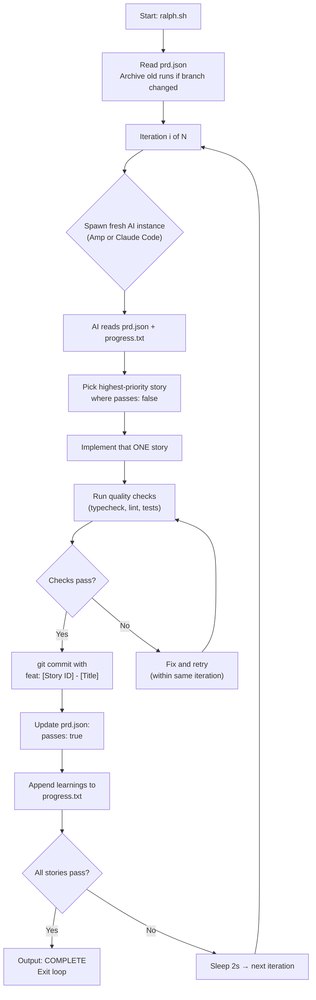
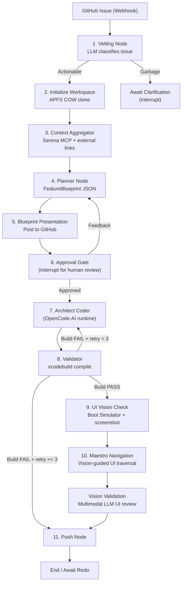
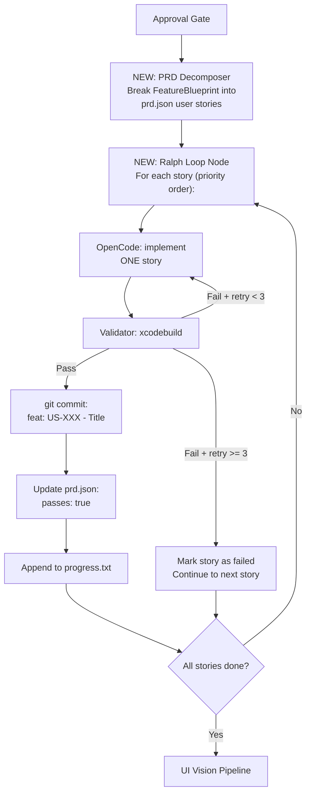

# Research: Ralph (snarktank/ralph) × Lios-Agent Integration

## 1. What is Ralph?

Ralph is an **autonomous AI agent loop** created by [Ryan Carson](https://x.com/ryancarson) and based on [Geoffrey Huntley's "Ralph Wiggum" technique](https://ghuntley.com/ralph/). At its absolute simplest, Ralph is a bash while-loop:

```bash
while :; do cat PROMPT.md | claude-code ; done
```

It spawns a fresh AI coding tool instance (either [Amp CLI](https://ampcode.com) or [Claude Code](https://docs.anthropic.com/en/docs/claude-code)) **repeatedly** until every item in a structured PRD (Product Requirements Document) is complete. Each iteration gets a **clean context window** — the only inter-iteration memory is:

1. **Git history** — commits from previous iterations
2. **`progress.txt`** — append-only learnings log
3. **`prd.json`** — user stories with `passes: true/false` status

> [!IMPORTANT]
> Ralph has **17.6k GitHub stars** and 1.8k forks (as of April 2026). It has been used at Y Combinator hackathons and reportedly delivered a $50K-scope contract for $297 in AI inference costs.

---

## 2. Ralph Architecture Deep Dive

### 2.1 Core Loop (`ralph.sh`)



### 2.2 Key Files

| File | Purpose |
|------|---------|
| `ralph.sh` | Bash loop spawning fresh AI instances (supports `--tool amp` or `--tool claude`) |
| `prompt.md` | System prompt for Amp instances |
| `CLAUDE.md` | System prompt for Claude Code instances |
| `prd.json` | Structured user stories with `passes` status (the task queue) |
| `progress.txt` | Append-only learnings and context for future iterations |
| `skills/prd/SKILL.md` | Skill for generating structured PRDs from feature descriptions |
| `skills/ralph/SKILL.md` | Skill for converting Markdown PRDs to `prd.json` format |

### 2.3 The `prd.json` Schema

```json
{
  "project": "MyApp",
  "branchName": "ralph/task-priority",
  "description": "Task Priority System - Add priority levels to tasks",
  "userStories": [
    {
      "id": "US-001",
      "title": "Add priority field to database",
      "description": "As a developer, I need to store task priority...",
      "acceptanceCriteria": [
        "Add priority column to tasks table",
        "Typecheck passes"
      ],
      "priority": 1,
      "passes": false,
      "notes": ""
    }
  ]
}
```

### 2.4 Key Design Principles (from Geoffrey Huntley)

1. **One item per loop** — Each iteration works on exactly ONE story to avoid context window exhaustion
2. **Monolithic, not multi-agent** — Single process, single repo, vertical scaling (avoids nondeterministic multi-agent coordination)
3. **Fresh context each iteration** — Prevents autoregressive context drift; state persists ONLY through git history + `progress.txt`
4. **Feedback loops are mandatory** — Typecheck, tests, linting, CI must stay green; broken code compounds
5. **Self-improving knowledge base** — `AGENTS.md` / `progress.txt` accumulate patterns and gotchas for future iterations
6. **Speed of the wheel matters** — Build + test must execute fast; the faster the loop turns, the better the results
7. **No placeholders** — Full implementations; guard against LLM bias toward minimal stubs

---

## 3. Lios-Agent Architecture (Current State)

For context, Lios-Agent is a **LangGraph-based autonomous iOS development orchestrator** with this pipeline:



### Key Lios-Agent Characteristics

| Aspect | Current Approach |
|--------|-----------------|
| **Trigger** | Single GitHub Issue → single end-to-end pipeline |
| **Code Generation** | OpenCode-AI (single invocation with `--dangerously-skip-permissions`) |
| **Planning** | LLM generates `FeatureBlueprint` JSON in one shot |
| **Build Verification** | xcodebuild with retry loop (max 3) |
| **UI Verification** | Simulator screenshot → Maestro navigation → Vision LLM |
| **Memory** | LangGraph checkpointer (SQLite); `AgentState` typed dict |
| **Retry Strategy** | Re-invoke OpenCode with compiler errors; max 3 retries |
| **Human Gates** | Blueprint approval, push approval (via GitHub comments / Slack) |

---

## 4. Gap Analysis: What Ralph Has That Lios-Agent Doesn't

````carousel
### 🔴 Gap 1: Multi-Story Task Decomposition

**Ralph**: Decomposes a feature into N small user stories via `prd.json`, each independently implementable and verifiable. Stories have explicit `priority` ordering and `passes` tracking.

**Lios-Agent**: Treats the entire GitHub issue as ONE atomic task. The `FeatureBlueprint` lists files to create/modify but doesn't break the work into independently verifiable increments. If one aspect fails, the entire task retries.

**Impact**: For complex features (e.g., "Add a Loyalty Points system" with schema + API + UI + tests), Lios-Agent either succeeds entirely or fails entirely in one giant OpenCode session. Ralph would break this into 6-8 small stories, each committed independently.

<!-- slide -->
### 🔴 Gap 2: Cross-Iteration Learning (`progress.txt`)

**Ralph**: Maintains an **append-only learnings log** that persists across iterations. The "Codebase Patterns" section acts as accumulated institutional knowledge. Each iteration reads this before starting.

**Lios-Agent**: No persistent cross-task learning. The `agent_skills` field reads static `.agent/*.md` files from the target repo, but never writes learnings back. Each new issue starts from scratch.

**Impact**: Repeated tasks on the same repo rediscover the same gotchas every time. Ralph's approach means the 5th iteration is smarter than the 1st.

<!-- slide -->
### 🔴 Gap 3: Incremental Git Commits Per Story

**Ralph**: Commits after each story passes quality checks, with messages like `feat: US-003 - Add priority selector`. This creates a clean, bisectable git history.

**Lios-Agent**: Makes one giant commit at the very end of the pipeline (in `push_node`). If the agent modifies 15 files across 4 logical changes, they all land as a single commit.

**Impact**: Harder to review PRs, harder to bisect regressions, harder to cherry-pick individual changes.

<!-- slide -->
### 🟡 Gap 4: Self-Improving AGENTS.md

**Ralph**: After each iteration, updates `AGENTS.md` files with discovered patterns, gotchas, and conventions. Future iterations (and human developers) benefit automatically.

**Lios-Agent**: Reads `AGENTS.md` / `.agent/skills/*.md` from the target repo but never contributes back. The `context_aggregator_node` is purely a consumer.

**Impact**: The target iOS repository doesn't accumulate agent-discovered patterns, meaning each run re-learns the same lessons.

<!-- slide -->
### 🟡 Gap 5: PRD-Level Task Planning (Not Just Architecture)

**Ralph**: Has a structured PRD generation skill (`skills/prd/SKILL.md`) that asks clarifying questions and produces detailed user stories with verifiable acceptance criteria.

**Lios-Agent**: Has a `planner_node` that generates a `FeatureBlueprint` (files to create/modify), but this is **architecture-level**, not **requirements-level**. There's no formal PRD or user story decomposition step.

**Impact**: Lios-Agent jumps straight to "what files to touch" without a requirements validation phase. This works for small issues but falls apart for feature-sized work.
````

---

## 5. Synergies: What Lios-Agent Has That Ralph Doesn't

| Lios-Agent Strength | Ralph Equivalent | Value |
|---------------------|------------------|-------|
| **GitHub/Slack native integration** | None (local CLI tool) | Lios-Agent is production-grade with webhook handlers, Slack C2, GitHub App auth |
| **Human approval gates** | None (fully autonomous) | Blueprint review before coding; push approval before merging |
| **iOS-native build verification** | Generic "typecheck + test" | xcodebuild, Simulator boot, Maestro UI navigation |
| **Vision-based UI validation** | "dev-browser skill" (web only) | Multimodal LLM validates iOS screenshots against design constraints |
| **MCP tool ecosystem** | None | Serena, XcodeBuildMCP, FigmaMCP provide deep codebase + build intelligence |
| **APFS COW workspace isolation** | Standard git clone | Near-instant workspace creation via macOS copy-on-write |
| **Checkpoint-based state** | Git-only state | LangGraph SQLite checkpointer allows pause/resume at any point |
| **PR review feedback loop** | None | Human code review comments trigger re-execution of coder→validator loop |

---

## 6. Integration Proposals

### Option A: "Ralph Loop" as a Graph Node (Recommended)

> Replace the single-shot `architect_coder_node` → `validator_node` loop with a Ralph-inspired multi-story execution engine.



**Changes Required:**

| File | Change |
|------|--------|
| [state.py](file:///Volumes/berkakyo/Users/berkamain/Developer/w0rk/lionparcel/Lios-Agent/agent/state.py) | Add `prd_json: dict`, `current_story_id: str`, `progress_log: str` fields |
| [graph.py](file:///Volumes/berkakyo/Users/berkamain/Developer/w0rk/lionparcel/Lios-Agent/agent/graph.py) | Add `prd_decomposer_node`, `ralph_loop_node`, refactor `architect_coder → validator` edge into inner loop |
| [tools.py](file:///Volumes/berkakyo/Users/berkamain/Developer/w0rk/lionparcel/Lios-Agent/agent/tools.py) | Add `update_prd_json()`, `append_progress_log()`, `commit_story()` tools |
| NEW `agent/ralph.py` | PRD decomposition logic, story selection, loop orchestration |

**Benefits:**
- Complex features decomposed into independently verifiable increments
- If story US-003 fails, stories US-001 and US-002 are already committed and safe
- `progress.txt` accumulates learnings across stories within the same feature
- Git history becomes bisectable with one commit per story
- Individual story failures don't block the entire feature

---

### Option B: PRD Planning Phase (Lighter Touch)

> Add a PRD generation step between blueprint approval and coding, but keep single-shot execution.

Insert a **PRD Decomposer Node** after the approval gate that:
1. Takes the approved `FeatureBlueprint`
2. Uses the PRD skill prompt to generate atomic user stories
3. Posts the decomposed plan to GitHub for a second review
4. Passes the stories to the existing `architect_coder_node` as enhanced instructions

This is simpler to implement but doesn't get the incremental-commit or cross-story-learning benefits.

---

### Option C: Progress Log Integration Only (Minimal)

> Add `progress.txt` mechanics to the existing pipeline without changing the execution model.

- After each successful task (issue), append learnings to a repo-level `.lios-agent/progress.txt`
- Before each new task, read this file in the `context_aggregator_node`
- After coding, update `.agent/AGENTS.md` with discovered patterns

This is the simplest integration and can be done in ~50 lines of code, but misses the most impactful benefits (multi-story decomposition).

---

## 7. Comparative Decision Matrix

| Criterion | Option A (Ralph Loop) | Option B (PRD Phase) | Option C (Progress Log) |
|-----------|:---:|:---:|:---:|
| **Effort to implement** | 🔴 High (3-5 days) | 🟡 Medium (1-2 days) | 🟢 Low (< 1 day) |
| **Impact on large features** | 🟢 Transformative | 🟡 Moderate | 🔴 Minimal |
| **Risk of regression** | 🟡 Moderate (new loop logic) | 🟢 Low (additive only) | 🟢 Very low |
| **Incremental commits** | ✅ Yes | ❌ No | ❌ No |
| **Cross-story learning** | ✅ Yes | ❌ No | 🟡 Cross-task only |
| **Self-improving AGENTS.md** | ✅ Yes | ❌ No | ✅ Yes |
| **Backward compatible** | ❌ Changes graph topology | ✅ New node, same edges | ✅ No graph changes |
| **Works with current OpenCode** | ✅ Multiple invocations | ✅ Enhanced single invocation | ✅ No change |

---

## 8. Recommended Strategy: Phased Rollout

### Phase 1: Quick Win (Option C) — Day 1

Add `progress.txt` and self-improving `AGENTS.md` mechanics to the existing pipeline. Minimal risk, immediate cross-task learning benefits.

### Phase 2: PRD Planning (Option B) — Week 1

Add a PRD decomposition node that produces atomic user stories. This gives better task scoping and acts as the foundation for Phase 3.

### Phase 3: Ralph Loop (Option A) — Week 2-3

Wire up the multi-story execution loop with per-story commits, progress logging, and failure isolation. This is the full Ralph integration that unlocks the biggest ROI for complex features.

---

## 9. Risks & Mitigations

| Risk | Mitigation |
|------|-----------|
| **Context window exhaustion** in multi-iteration loops | Ralph's design explicitly addresses this: each iteration gets fresh context. For Lios-Agent, each OpenCode invocation already starts fresh. |
| **Nondeterministic story ordering** causes dependency failures | Enforce strict `priority` ordering in PRD decomposition. Stories must be ordered: schema → backend → UI → integration. |
| **Increased total LLM cost** (N iterations vs 1 big call) | Counterintuitively, smaller focused calls are often cheaper than one giant call that gets confused and wastes tokens retrying. Geoffrey Huntley reports $297 for a $50K feature scope. |
| **OpenCode session continuity** | Current `opencode_session_id` mechanism works per-story. Each story gets its own fresh OpenCode invocation. |
| **Build time bottleneck** | xcodebuild per story is expensive. Mitigate by batching non-UI stories and only running full builds at story boundaries. Use Lios-Agent's existing `xcodebuild_cached.sh` pattern. |

---

## 10. Key Takeaways

1. **Ralph's secret sauce isn't the bash loop** — it's the **decomposition discipline** (one story per iteration) and the **learning accumulation** (`progress.txt` + `AGENTS.md` updates).

2. **Lios-Agent's secret sauce is production-grade infrastructure** — GitHub webhooks, Slack C2, human approval gates, iOS-specific build/test/vision verification. Ralph has none of this.

3. **They are deeply complementary**: Ralph provides the execution philosophy (decompose → iterate → learn → commit), and Lios-Agent provides the infrastructure (trigger → validate → approve → deploy).

4. **The highest-leverage integration is Option A** (Ralph Loop as a graph node), but it should be built incrementally starting with Option C (progress logs) to de-risk the approach.

5. **Geoffrey Huntley's key insight**: *"LLMs are mirrors of operator skill"* — the quality of the output is directly proportional to the quality of the decomposition, the tightness of the feedback loops, and the accumulated learnings. This maps perfectly to Lios-Agent adding structured PRD decomposition and `progress.txt` mechanics.
